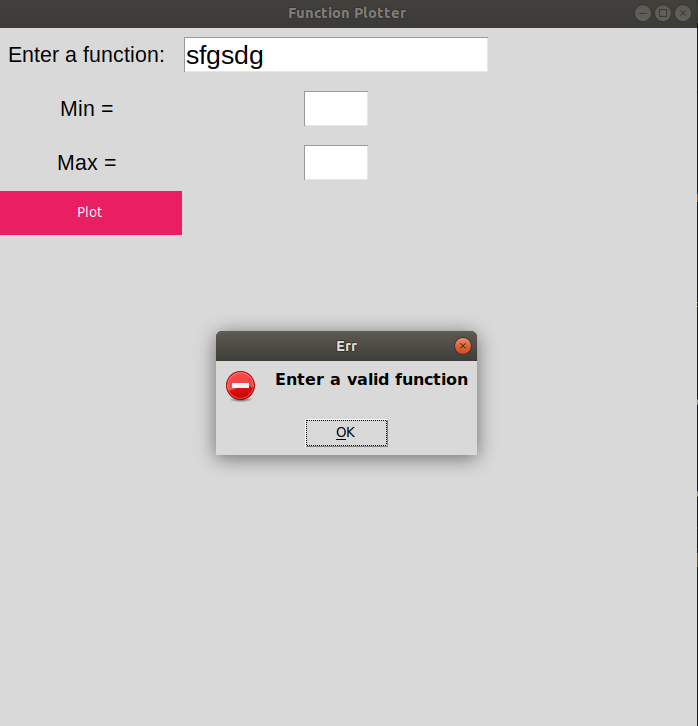
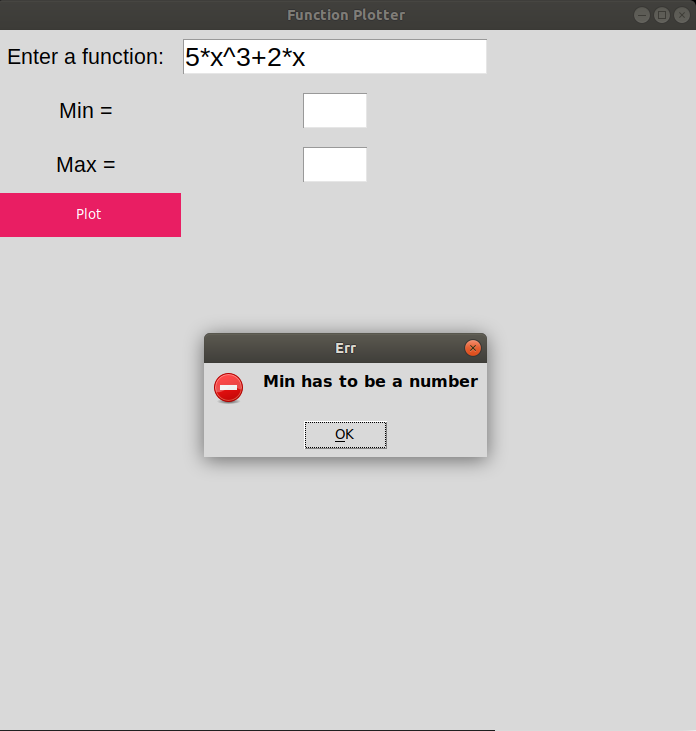
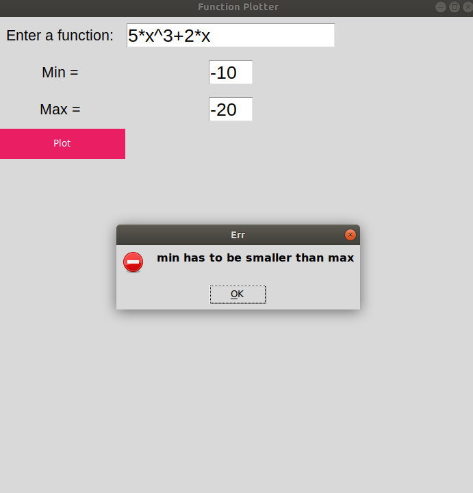
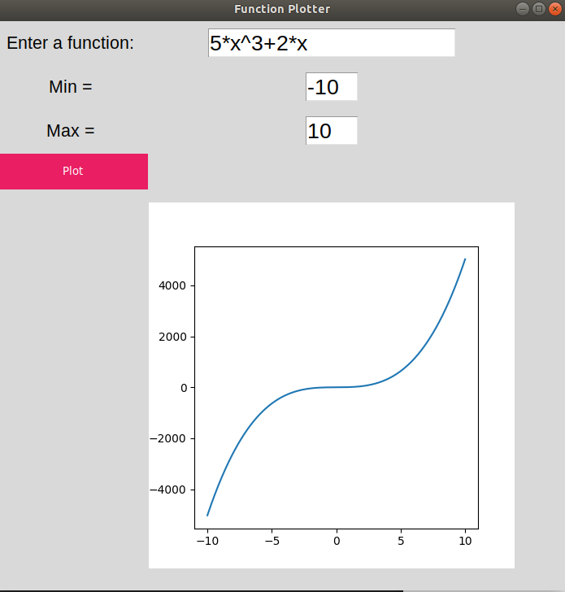

# Function Plotter

## GUI Application to plot a user given function

## How to run
- install the dependencies
- on linux run: `python3 plotter.py`
- on windows run: `python3 plotter.py`

## Test Example

